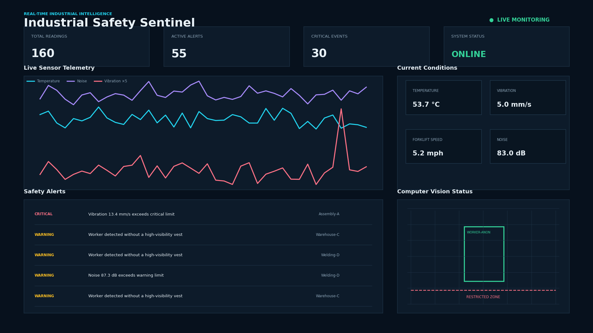
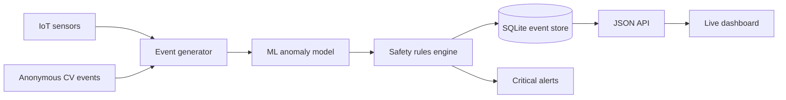

# Industrial Safety Sentinel

[](https://github.com/Rajdev-teach/industrial-safety-sentinel/actions)
[](https://python.org)
[](LICENSE)

**A real-time industrial workplace safety platform combining IoT telemetry, anonymous computer-vision events, machine-learning anomaly detection, automated alerting, and incident analytics.**



## Business problem

Factories generate safety signals across cameras, machines, forklifts, and environmental sensors. These signals often remain separated until an incident occurs. Industrial Safety Sentinel unifies them into one operational view and prioritizes actionable risks: missing PPE, restricted-zone entry, unsafe speed, excessive vibration, heat, and noise.

This project connects my **Mechanical Engineering foundation** with **Information Systems, Python, data engineering, machine learning, and industrial analytics**.

## Live architecture



## What it detects

- Machine temperature above warning and critical limits
- Excessive vibration associated with mechanical risk
- Unsafe forklift speed
- High workplace noise
- Workers missing helmets or high-visibility vests
- Anonymous worker entry into restricted machine zones
- Unusual multivariate sensor patterns using Isolation Forest

No facial recognition is used. Computer-vision events use anonymous worker identifiers and synthetic data.

## Technology

| Area | Implementation |
|---|---|
| Real-time ingestion | Python event producer with one-second streaming |
| IoT/CV simulation | Reproducible multi-zone data generator |
| Machine learning | Scikit-learn Isolation Forest |
| Rules engine | Configurable warning and critical thresholds |
| Database | Indexed SQLite event and alert tables |
| API | Python threaded HTTP JSON endpoints |
| Dashboard | Responsive HTML, CSS, Canvas and JavaScript |
| Quality | Pytest, GitHub Actions and deterministic fixtures |

## Run locally

```bash
git clone https://github.com/Rajdev-teach/industrial-safety-sentinel.git
cd industrial-safety-sentinel
python -m venv .venv
source .venv/bin/activate       # Windows: .venv\Scripts\activate
pip install -r requirements.txt
python scripts/seed_demo.py
python -m safety_sentinel.server
```

Open `http://localhost:8000`. The producer adds a new reading every second and the dashboard refreshes every two seconds.

## API endpoints

- `GET /api/metrics` — total readings, alerts, critical and open events
- `GET /api/readings` — latest sensor and anonymous vision readings
- `GET /api/alerts` — latest prioritized safety events

## Testing

```bash
pytest -q
```

The suite validates deterministic generation, threshold alerts, PPE and restricted-zone detection, ML anomaly detection, and database persistence.

## Demo

[Download the short dashboard demonstration](docs/industrial-safety-demo.mp4)

The repository includes a seeded screenshot and short MP4 showing simulated live monitoring. All people, events, sensors, and locations are synthetic.

## Production roadmap

- Replace the generator with MQTT/Kafka ingestion
- Add YOLO PPE detection at an edge device
- Use PostgreSQL/TimescaleDB for high-volume telemetry
- Add authentication, role-based access, encryption, and audit retention
- Integrate SMS/Teams notifications and CMMS work orders
- Evaluate false alarms with safety specialists before operational use

## Responsible use

This is a portfolio demonstration, not a certified safety system. Production deployment requires validated sensors, approved camera governance, human review, documented thresholds, cybersecurity controls, and compliance with site policies and applicable regulations.
